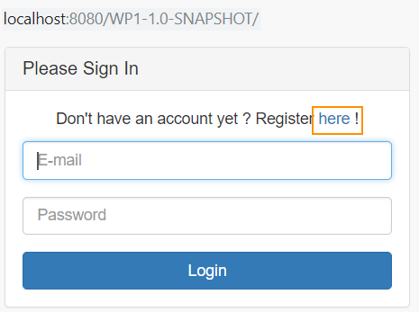
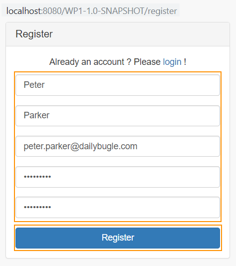
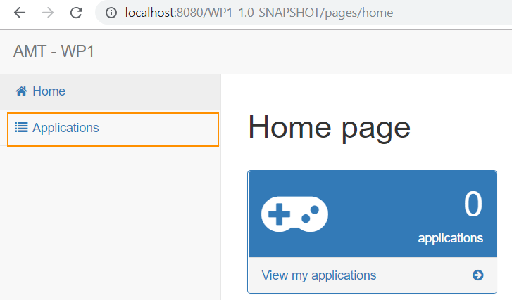
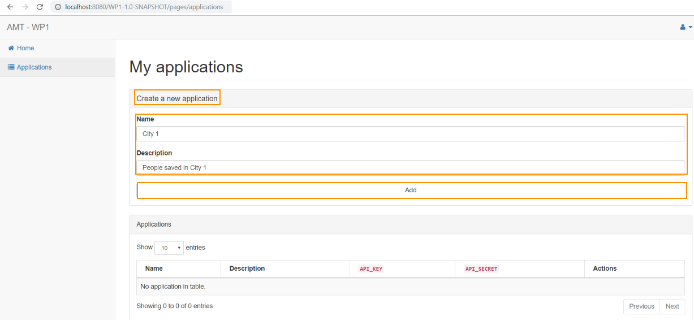
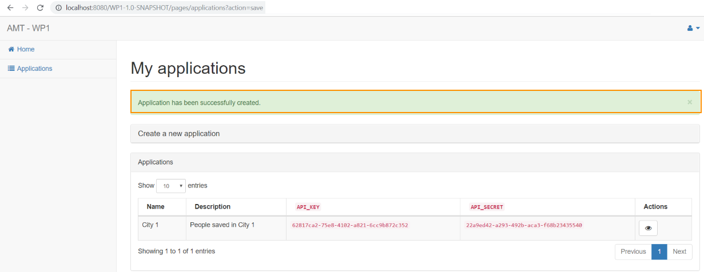
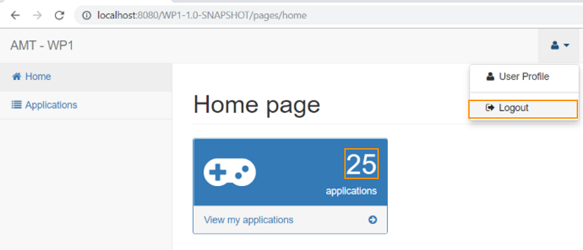

# Automated functional tests

## Setting tests environnement

Automated functionnal tests are made with Fluentlenium, which is *a website automation framework which extends Selenium to write reliable and resilient UI functional tests.* Read more about it [here](http://fluentlenium.org/).

The following dependencies are already set in the pom.xml file :
```
<dependency>
    <groupId>org.fluentlenium</groupId>
    <artifactId>fluentlenium-core</artifactId>
    <version>3.4.1</version>
</dependency>
<dependency>
    <groupId>org.fluentlenium</groupId>
    <artifactId>fluentlenium-junit</artifactId>
    <version>3.4.1</version>
</dependency>
<dependency>
    <groupId>org.fluentlenium</groupId>
    <artifactId>fluentlenium-assertj</artifactId>
    <version>3.4.1</version>
</dependency>
<dependency>
    <groupId>org.seleniumhq.selenium</groupId>
    <artifactId>selenium-chrome-driver</artifactId>
    <version>3.14.0</version>
</dependency>
```

Fluentlenium is configured to work with Chrome. To run the tests it is required to download the [Chrome driver](http://chromedriver.chromium.org/) and place it in the wp1/application folder.

Fluentlenium tests are located under wp1/src/test/java/ch.heigvd.amt.wp1/fluentlenium :

* Wp1FluentScenario1Test.java contains a UI test scenario

* *Wp1FluentTest.java* contains small UI tests
* the subdirectory *pages* contains usefull constants and functions related to each page of the website, helping tests management over time.


## Available tests

#### Statements
Tests are set up to work with the current projet developement stage which implies, amount others, that the database is wiped each time the project is restarted<br>

Hence :

* Tests modify the database and change its sate
* It may be required to restart the database to execute certain tests again
* To verify whether a user exists or not, the amount of registered should not exceed 100 (otherwise the verification should include users table browsing)


#### Test scenario 1

`devAppShouldRegisterCreateAppsBrowseAndLogOut`

* App developer registers and logs in 
  * *User heads to the login page*



​	assertion : current page is login*

  * *user clicks "here" to register*

    assertion : current page is register

  * *user fills personal information and registers*

    

    *assertion : after clicking "Register" button, the current page is home (logged in)*

* App developer creates 25 applications

  * user clicks on "Applications"

  

  *assertion : current page is applications*

  * user creates apps one by one by :
    * clicking "Create a new application" to open the drawer
    * entering app information 
    * clicking "Add" button
  
  
  *assertion : alert message "Application has been successfully created." is shown*

* App developer browses to the last application table page
  * user bowses by clicking "Next" button under the table
  
  *assertion : there are 10 applications in the table before clicking "Next" button*<br>
  *assertion : there are 10 applications in the table  before clicking "Next" for the second time*<br>
  *assertion : there are 5 applications in the table*

* App developer logs out
  * user clicks "Home" before logging out and sees the amount of applications owned
  
  
  *assertion : number of application displayed is 25*<br>
  *assertion : after clicking logout, current page is login*

* App developer tries to go back to the applications page but is redirected to login page
  * user browses to applications page while logged out
  
  *assertion : current page is login*


### Other tests

##### Registration / login
`itShouldNotBePossibleToRegisterWithoutInformation` 
* go to login and hit "here" to register
* click "Register" without filling information

*assertion : current page is login before clicking "here" link*<br>
*assertion : current page is register after clicking "here" link*<br>
*assertion : current page is still register after clicking "Register" button*<br><br>


`successfulRegistrationShouldBringUserToHomePage`
* go to login and hit "here" to register
* enter non-existing, valid information

*assertion : current page is login before clicking "here" link*<br>
*assertion : current page is register after clicking "here" link*<br>
*assertion : current page is home after filling information and clicking "Register" button*<br><br>


`itShouldNotBePossibleToRegisterWithTwoDifferentPassword`
* go to login and hit "here" to register
* enter non-existing, information but 2 different passwords

*assertion : current page is login before clicking "here" link*<br>
*assertion : current page is register after clicking "here" link*<br>
*assertion : current page is still register after filling information and clicking "Register" button*<br><br>


`itShouldNotBePossibleToRegisterWithAnExistingEmail`
- go to login and hit "here" to register
- enter valid information but an existing e-mail  (default in database)

*assertion : current page is login before clicking "here" link*<br>
*assertion : current page is register after clicking "here" link*<br>
*assertion : current page is still register after filling information and clicking "Register" button*<br><br><br><br>


`itShouldNotBePossibleToSigninWithAnInvalidEmail`
- go to login and enter bad credentials

  *assertion : current page is login before clicking "Login" button*<br>
  *assertion : current page is login after clicking "Login" button*<br><br>


`successfulSigninShouldBringUserToHomePage`
- go to login and enter valid credentials (default admin in database)

*assertion : current page is login before clicking "Login" button*<br>
*assertion : current page is home after clicking "Login" button*<br><br>


##### Users administration
The following tests use `successfulSigninShouldBringUserToHomePage` code to login with default admin and browse to the users page.<br><br>


`adminShouldBeAbleToCreateAUser`
* create app developer user

*assertion : alert message "User created." is shown*<br><br>


`adminShouldNotBeAbleToCreateAUserWithoutEmail`
* fill add user form but without an email address

*assertion : user in not in users table* : relevant if < 10 users<br><br>


`adminShouldNotBeAbleToCreateDuplicateUser`
* fill add user form with an existing email address

*assertion : alert message "This email address already exist." shown*<br>
*assertion : the user appears only once in the table*<br><br>


`adminShouldBeAbleToModifyUser`
* modify second user last name (default user) and presses "Save"

*assertion : alert message "User has been successfully updated." shown*<br>
*assertion : the user appears once in the table*<br><br>


`adminShouldBeAbleToResetUser`
- modify user state to RESET ("Reset")

*assertion : alert message "Password reset, email sent." shown*<br><br>


`adminShouldBeAbleToDeleteUser`
* delete 4th user (default user)

*assertion : alert message "User has been successfully deleted." shown*<br>
*assertion : default user 4 not in the users table*<br><br>


##### Applications administration
The following tests use `successfulSigninShouldBringUserToHomePage` code to login with default admin and browse to the applications page.<br><br>


`adminShouldBeAbleToCreateApplication`
* create an app

*assertion :  alert message "Application has been successfully created." shown*<br>
*assertion :  app name found once in the apps table*<br><br>


`adminShouldNotBeAbleToCreateDuplicateApplication`
* create an app
* create a second app with same fields

*assertion :  alert message "Another application has the same name. Please change." shown*<br>
*assertion :  app name found only once in the apps table*<br><br>


`adminShouldBeAbleToCreateAndModifyApplication`
* create an app
* modify the previously created app name and description

*assertion :  alert message "Application has been successfully updated." shown*<br>
*assertion :  old app name doesn't appear in the table*<br>
*assertion :  newapp name appears  once in the table*<br><br>


`adminShouldBeAbleToDeleteApplication`
- create an app if necessary
- delete first app in the table

*assertion :  alert message "Application has been successfully deleted." shown*<br>
*assertion :  there is one app less at the end*<br><br>


##### APP DEVELOPER ACTIONS
`resetUserMustSetAValidPassword`
- log in with default reset app developer
- try reaching applications page
- change for empty password
- change for valid password
- try reaching applications page

*assertion : first page after login is profile page*<br>
*assertion : page stays profile while password not set*<br>
*assertion : danger message "Password can't be empty." shown when trying to set with empty string*<br>
*assertion : success message "Profile has been successfully updated." shown when setting with valid string*<br>
*assertion : user is on apps page after clicking "Applications" (and password)*<br><br>


`appDevelopperShouldNotSeeUsers`
* login as default app developer
* try reaching users page

*assertion : page stays the home page*<br>
*assertion :  alert message "You do not have the rights to access this page." shown*<br><br>


`appDevelopperShouldBeAbleToCreateModifyAndDeleteIt`
* login as default app developer
* create app
* modify app name and description
* delete app

*assertion : correct alert message after each action*<br>
*assertion :  new app appears in the table*<br>
*assertion :  modified app name appears in the table*<br>
*assertion :  old app name doesn't appear in the table anymore*<br>
*assertion :  deleted app doesn't appear in the table anymore*<br><br>


##### Navigation

`itShouldbePossibleToNavigateBetweenLoginAndRegisterWithoutError`
* go to login
* move to register

*assertion : first page is login*<br>
*assertion : second page is register*<br>
*assertion : third page is login again*<br><br>


`itShouldBePossibleToBrowseToUsersFrom2Links`
* go to users by clicking in the home "users" card
* go back to home page
* go to users by clicking on the side panel

*assertion : page is users after clicking in the card*<br>
*assertion : page is also users after clicking on the panel*<br><br>


`userShouldNotBeAbleToAccessHomeAfterLogout`
* login as default admin
* log out
* try reaching home page

*assertion : current page is home after logging in*<br>
*assertion : current page is login after logging out*<br>
*assertion : current page remains login when trying to reach home page*
