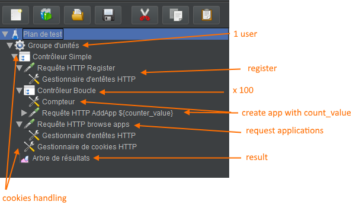

# Pagination test

## Notes
After the demonstration, we understood what was the question about. We won't implement and discuss the experiment but
here is what we should have done instead of the primary discussion we had.

We have implemented the pagination as followed:

- JPA manages the records in the database.
- JPA retrieves the records from the database in `GenericDAO` and sub-classes.
- JPA asks to retrieve from the database a only certain amount of data (using `.setMaxResults(length)`, `.setFirstResult(start)`).
- The resource (`ApplicationsResource`, `UsersResource`) returns the data to the users, already filtered.
    
Another approach - that we didn't do - is the following:

- The database manages the records in the database.
- The database retrieves the *ALL* records from the database in `GenericDAO` and sub-classes.
- The database returns all the data to the servlet.
- The servlet is in charge to filter the wanted data from the user.
- The resource (`ApplicationsResource`, `UsersResource`) returns the filtered data to the users.

So, what's the differences ?

The first approach is - indeed - optimized. We ask the database to only retrieve the wanted data, without anything useless.
We don't have to store unwanted data in the servlet, don't have to process them and we only use relevant records from the
database.

The second approach store *ALL* the records in memory, has to process them and then, return wanted and relevant records
which is unoptimized.

How should have we tested that ?

We should have implemented the two approaches and compare them using adequate tools (JMeter for instance ) to measure
the CPU load, memory consumption, the throughput and simultaneous connections.

We didn't understand the question at the beginning so the following discussion might not be relevant.

## Testing tools used

* [Postman](https://www.getpostman.com/) : this tool is used to capture the queries between the web browser and the web application
* [JMeter](https://jmeter.apache.org/) :  this tool is used to script a sequence of requests to send to the web application

## Pagination manager

* [JPA](https://www.oracle.com/technetwork/java/javaee/tech/persistence-jsp-140049.html) : Java Persistence API

## Test scenario 1 - no pagination

 JMeter script can be found under *wp1/jmeter-scripts/no_pagination.jmx*

### Description

* an app developer registers
* he creates 100 applications
* he accesses the api to see the JSON representation of his applications



API url GET : `http://localhost:8080/WP1-1.0-SNAPSHOT/api/applications`

### JSON Result

```Json
{
    "recordsFiltered": 100,
    "data": [
        {
            "createdDate": 1542283231000,
            "apiKey": "1cc673f4-9bf2-4084-b394-25a3f5ea3b98",
            "name": "testApp1",
            "description": "jmeterApp1",
            "apiSecret": "5fe1a602-4469-41d7-b1c9-6e3d0895a70b",
            "id": 1
        },
        {
            "createdDate": 1542283234000,
            "apiKey": "bad67c54-dc17-4dba-94a4-db8a8e38a583",
            "name": "testApp2",
            "description": "jmeterApp2",
            "apiSecret": "711906c1-43d3-41c0-89b7-02c0dd82d4f8",
            "id": 2
        },
       								.
        							.
        							.
        {
            "createdDate": 1542283240000,
            "apiKey": "74aae356-5643-4bff-a58e-a8dd9ac325e1",
            "name": "testApp99",
            "description": "jmeterApp99",
            "apiSecret": "e22dcffc-bfa6-481b-9fc6-d06b856e1bfc",
            "id": 99
        },
        {
            "createdDate": 1542283240000,
            "apiKey": "35485624-78e6-4331-a8c3-e0eddfa75c70",
            "name": "testApp100",
            "description": "jmeterApp100",
            "apiSecret": "aa263879-dbef-4aae-9e4b-19c879132b77",
            "id": 100
        }
    ],
    "draw": 0,
    "recordsTotal": 100
}
```

This files contains all applications of registered  app developper

### Problems

* The user might have thousands of applications and won't be able to display them on the same page
* Useless network load
* Useless Browser task load

### Solution : Pagination

The idea behind pagination is to handle big collections with portions of the collection named "pages".

Now the browser requests only fractions of the big collection, avoiding unnecessary working and networking loads. In the project, the applications are shown in a table with default length of 10 applications.

Therefore it requests by default only  (max) 10 applications to the database. It however knows how many applications the users owns, so it creates page indices that can be directly accessed (offset). 

Example : user has 100 applications shown in a table of max 10 => the table retrieves and shows only 10 results, but shows 10 accessible indices.


This is done in the app by using  Java Persistence API in the users and applications DAO's

*ApplicationsDAO.java* :

```java
@Override
public List<Application> findAllByUser(User user, int length, int start) throws BusinessDomainEntityNotFoundException {
    List<Application> result = null;

    try {
        result = (List<Application>) em
                .createNamedQuery("Application.findAllByUser")
                .setParameter("owner", user)
                .setMaxResults(length)
                .setFirstResult(start).getResultList();
    } catch (NoResultException e) {
        throw new BusinessDomainEntityNotFoundException();
    }

    return result;
}
```

* `length` determines the number of applications to retrieve
* `start`determines the offset 


## Test scenario 2 - with pagination

 JMeter script can be found under *wp1/jmeter-scripts/pagination.jmx*


### Description

- an app developer registers
- he creates 100 applications
- he accesses the api with offset and lentgh parameters to see the JSON representation of the first "page" of applications

The Jmeter script "architecture" is the same but "Requête HTTP browse apps" uses the following url  found via Postman : `http://localhost:8080/WP1-1.0-SNAPSHOT/api/applications?draw=1&columns%5B0%5D%5Bdata%5D=name&columns%5B0%5D%5Bname%5D=&columns%5B0%5D%5Bsearchable%5D=true&columns%5B0%5D%5Borderable%5D=false&columns%5B0%5D%5Bsearch%5D%5Bvalue%5D=&columns%5B0%5D%5Bsearch%5D%5Bregex%5D=false&columns%5B1%5D%5Bdata%5D=description&columns%5B1%5D%5Bname%5D=&columns%5B1%5D%5Bsearchable%5D=true&columns%5B1%5D%5Borderable%5D=false&columns%5B1%5D%5Bsearch%5D%5Bvalue%5D=&columns%5B1%5D%5Bsearch%5D%5Bregex%5D=false&columns%5B2%5D%5Bdata%5D=apiKey&columns%5B2%5D%5Bname%5D=&columns%5B2%5D%5Bsearchable%5D=true&columns%5B2%5D%5Borderable%5D=false&columns%5B2%5D%5Bsearch%5D%5Bvalue%5D=&columns%5B2%5D%5Bsearch%5D%5Bregex%5D=false&columns%5B3%5D%5Bdata%5D=apiSecret&columns%5B3%5D%5Bname%5D=&columns%5B3%5D%5Bsearchable%5D=true&columns%5B3%5D%5Borderable%5D=false&columns%5B3%5D%5Bsearch%5D%5Bvalue%5D=&columns%5B3%5D%5Bsearch%5D%5Bregex%5D=false&columns%5B4%5D%5Bdata%5D=id&columns%5B4%5D%5Bname%5D=&columns%5B4%5D%5Bsearchable%5D=true&columns%5B4%5D%5Borderable%5D=false&columns%5B4%5D%5Bsearch%5D%5Bvalue%5D=&columns%5B4%5D%5Bsearch%5D%5Bregex%5D=false&start=0&length=10&search%5Bvalue%5D=&search%5Bregex%5D=false&_=1542283991532`


### JSON Result

```json
{
    "recordsFiltered": 100,
    "data": [
        {
            "createdDate": 1542287311000,
            "apiKey": "81c0396e-90dd-482e-8fbc-6f58e94c8a1a",
            "name": "testApp1",
            "description": "jmeterApp1",
            "apiSecret": "f0a2882c-7a48-4ca7-8fb0-dbab5b249692",
            "id": 1
        },
        {
            "createdDate": 1542287315000,
            "apiKey": "e4dd0817-6b6c-4ae3-9ebf-49611807be61",
            "name": "testApp2",
            "description": "jmeterApp2",
            "apiSecret": "94819bf2-0b10-4932-8ea1-7de566dcb150",
            "id": 2
        },
       								.
        							.
        							.
        {
            "createdDate": 1542287316000,
            "apiKey": "044cec01-0b22-486f-91b7-8353f94eda94",
            "name": "testApp9",
            "description": "jmeterApp9",
            "apiSecret": "c3e2a4c9-4a90-4fb4-8ca4-5d1cf4b7d2cd",
            "id": 9
        },
        {
            "createdDate": 1542287316000,
            "apiKey": "3ff76571-53c7-493c-9742-65dba6baed54",
            "name": "testApp10",
            "description": "jmeterApp10",
            "apiSecret": "f81a0a9b-1110-446c-bc53-8716d471ba09",
            "id": 10
        }
    ],
    "draw": 1,
    "recordsTotal": 100
}
```

### Analysis

- There are only 10 applications
- `recordsTotal` is 100, to create index
- new query has to be done to retrieve the next applications, but all queries are "lightweight"